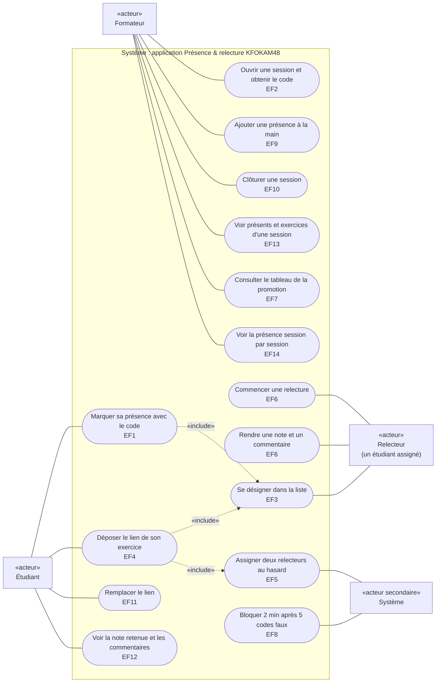

# D1 — Cas d'utilisation

Les acteurs et ce que chacun peut faire. Acteurs principaux à gauche, acteurs qui ne font que réagir (relecteur assigné, système) à droite. Le relecteur n'est pas un acteur distinct : c'est un étudiant auquel le système a assigné une relecture (cahier des charges, section 2).

## Relations «extend»

Elles ne sont pas dessinées pour garder le diagramme lisible. Une extension ajoute un comportement au cas de base, seulement sous une condition.

| Cas qui étend | Cas de base | Condition | Règle |
|---|---|---|---|
| Assigner deux relecteurs au hasard | Marquer sa présence avec le code | la session a des exercices auxquels il manque un ou deux relecteurs | RG15 |
| Assigner deux relecteurs au hasard | Ajouter une présence à la main | la session a des exercices auxquels il manque un ou deux relecteurs | RG15 |
| Bloquer 2 min après 5 codes faux | Marquer sa présence avec le code | c'est le 5e `CODE_INCONNU` consécutif | RG7 |

## Qui fait quoi

| Cas d'utilisation | Acteur | Exigence | Règles de gestion | Priorité |
|---|---|---|---|---|
| Marquer sa présence avec le code | Étudiant | EF1 | RG1, RG4, RG6, RG9 | Must |
| Ouvrir une session et obtenir le code | Formateur | EF2 | RG1, RG5 | Must |
| Se désigner dans la liste | Étudiant, Relecteur | EF3 | Q1 | Must |
| Déposer le lien de son exercice | Étudiant | EF4 | RG10, RG11, RG12, RG24 | Must |
| Assigner deux relecteurs au hasard | Système | EF5 | RG2, RG13, RG14, RG15 | Must |
| Commencer une relecture, rendre une note et un commentaire | Relecteur | EF6 | RG2, RG3, RG16, RG17, RG18 | Must |
| Consulter le tableau de la promotion | Formateur | EF7 | RG19, RG22 | Must |
| Bloquer 2 min après 5 codes faux | Système | EF8 | RG7 | Should — sorti de la v1.0 |
| Ajouter une présence à la main | Formateur | EF9 | RG4, RG8, RG9 | Should — sorti de la v1.0 |
| Clôturer une session | Formateur | EF10 | RG21 | Should — sorti de la v1.0 |
| Remplacer le lien | Étudiant | EF11 | RG12, RG23 | Should — sorti de la v1.0 |
| Voir la note retenue, provisoire ou non, et les commentaires | Étudiant | EF12 | RG20, RG25 | Must (promue à l'étape 3) |
| Voir présents et exercices d'une session | Formateur | EF13 | RG8 | Should — sorti de la v1.0 |
| Voir la présence session par session | Formateur | EF14 | RG22 | Could — sorti de la v1.0 |
