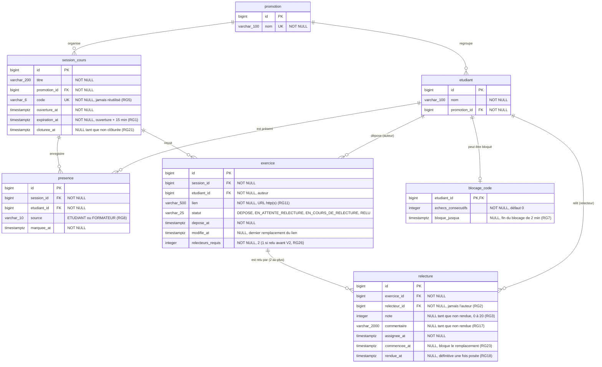

# D2 — Modèle de données

Les tables, leurs colonnes et leurs cardinalités, **avec les noms exacts des migrations Flyway** (`backend/src/main/resources/db/migration/`), **après V2** : depuis l'étape 3, un exercice est relu par deux pairs (RG13), la relecture a donc son propre identifiant. Chaque table correspond à une entité JPA du paquet `entity`, jamais exposée en JSON (B3).

## Cardinalités

| Relation | Cardinalité | Lecture |
|---|---|---|
| promotion → etudiant | 1 — 0..* | un étudiant appartient à une seule promotion |
| promotion → session_cours | 1 — 0..* | une session est ouverte pour une seule promotion |
| session_cours → presence | 1 — 0..* | au plus une présence par étudiant et par session (RG4) |
| etudiant → presence | 1 — 0..* | un étudiant est présent à plusieurs sessions |
| session_cours → exercice | 1 — 0..* | au plus un exercice par étudiant et par session (RG10) |
| etudiant → exercice | 1 — 0..* | l'étudiant auteur |
| exercice → relecture | 1 — 0..2 | 0 tant que l'exercice est `DEPOSE` (RG15), 2 une fois ses relecteurs trouvés (RG13) ; 1 pour un exercice relu avant la migration V2 (RG26) |
| etudiant → relecture | 1 — 0..* | l'étudiant relecteur ; il n'existe pas de table `relecteur` |
| etudiant → blocage_code | 1 — 0..1 | ligne créée au premier code faux (RG7) |

## Contraintes posées par la migration

| Table | Contrainte | Règle |
|---|---|---|
| `promotion` | `UNIQUE (nom)` | — |
| `session_cours` | `UNIQUE (code)` | RG5 |
| `presence` | `UNIQUE (session_id, etudiant_id)` | RG4 |
| `presence` | `CHECK (source IN ('ETUDIANT', 'FORMATEUR'))` | RG8 |
| `exercice` | `UNIQUE (session_id, etudiant_id)` | RG10 |
| `exercice` | `CHECK (statut IN ('DEPOSE', 'EN_ATTENTE_RELECTURE', 'EN_COURS_DE_RELECTURE', 'RELU'))` | D4 |
| `relecture` | `CHECK (note BETWEEN 0 AND 20)` | RG3 |
| `relecture` | `UNIQUE (exercice_id, relecteur_id)` : un pair ne relit pas deux fois le même exercice (V2) | RG13, RG14 |
| `exercice` | `CHECK (relecteurs_requis IN (1, 2))` (V2) | RG13, RG26 |

**Types.** Mermaid n'accepte pas d'espace ni de parenthèse dans un type : `varchar_100` se lit `VARCHAR(100)`, `timestamptz` se lit `TIMESTAMP WITH TIME ZONE`. Les identifiants `bigint` sont générés par la base (`GENERATED BY DEFAULT AS IDENTITY`), sauf `blocage_code.etudiant_id`, qui reprend la clé de son parent. Jusqu'à V2, `relecture` avait pour clé `exercice_id` (une relecture par exercice, Q6) ; V2 la recrée avec son propre `id` en conservant toutes les relectures existantes.

**Le formateur n'a pas de table** : il n'a pas de compte (Q1), aucune donnée ne le désigne.
