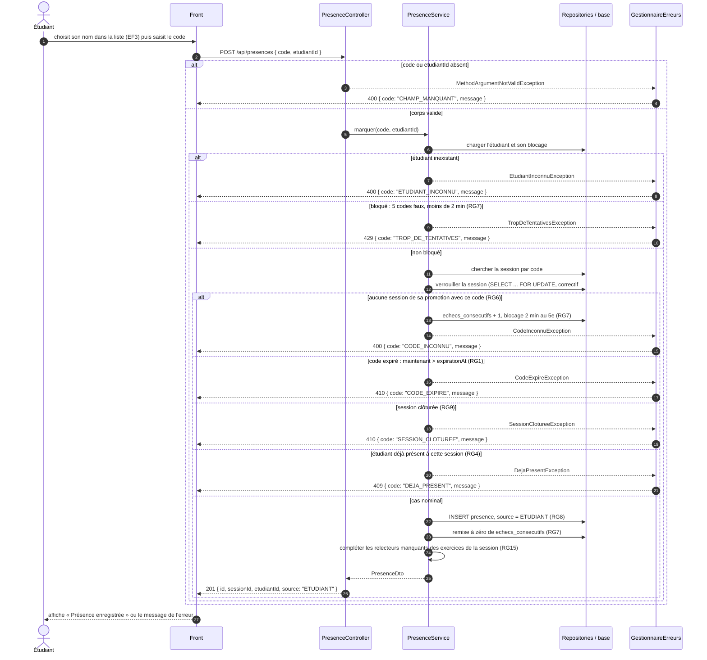

# D3 — Séquence : marquer sa présence

Le cas nominal et tous les cas d'erreur de `POST /api/presences`, dans l'ordre où le service les vérifie. Chaque code HTTP est celui de `api/contrat.yaml`. Chaque exception métier est traduite par `GestionnaireErreurs` (`@RestControllerAdvice`) au format imposé `{ code, message }`.

## Correspondance avec le contrat

| Branche | Code HTTP | Code d'erreur | Déclaré dans `api/contrat.yaml` | Règle |
|---|---|---|---|---|
| Cas nominal | `201` | — | oui, imposé | RG8 |
| Code ou `etudiantId` absent | `400` | `CHAMP_MANQUANT` | oui, `400` imposé | — |
| Étudiant inexistant | `400` | `ETUDIANT_INCONNU` | oui, `400` imposé | — |
| Code inconnu, ou code d'une autre promotion | `400` | `CODE_INCONNU` | oui, imposé | RG6 |
| Étudiant bloqué | `429` | `TROP_DE_TENTATIVES` | oui, **ajouté** pendant l'analyse (Q4) | RG7 |
| Code expiré | `410` | `CODE_EXPIRE` | oui, imposé | RG1 |
| Session clôturée | `410` | `SESSION_CLOTUREE` | oui, `410` imposé | RG9 |
| Déjà présent | `409` | `DEJA_PRESENT` | oui, imposé | RG4 |

**Blocage après 5 codes faux (RG7, `429`)** : sorti du périmètre de la v1.0 à l'étape 3 (#10) ; la branche reste décrite pour la version suivante.

**Correctif #56.** La session est verrouillée avant les vérifications : deux présences simultanées de la même session s'enregistrent l'une après l'autre, et la seconde ne peut plus assigner le même exercice que la première.

Le compteur d'échecs est enregistré dans une transaction séparée : l'exception `CodeInconnuException` n'annule pas l'incrément (RG7).
