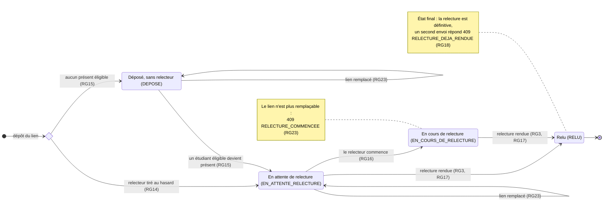

# D4 — États-transitions : cycle de vie d'un exercice

La colonne `exercice.statut` (D2) ne prend que ces quatre valeurs. Le cycle demandé, « déposé → en attente de relecture → relu », est complété par l'état « en cours de relecture », qui rend observable le début de la relecture (Q13, RG23).

## Transitions et refus

| Depuis | Événement | Vers | Refusé si… | Réponse en cas de refus |
|---|---|---|---|---|
| — | Dépôt `POST /api/exercices` | `EN_ATTENTE_RELECTURE` ou `DEPOSE` | lien invalide · déjà déposé · session clôturée · session d'une autre promotion | `400 LIEN_INVALIDE` · `409 EXERCICE_DEJA_DEPOSE` · `409 SESSION_CLOTUREE` · `400 ETUDIANT_HORS_PROMOTION` |
| `DEPOSE` | Un étudiant éligible devient présent | `EN_ATTENTE_RELECTURE` | — | — |
| `DEPOSE`, `EN_ATTENTE_RELECTURE` | Remplacement du lien `PUT /api/exercices/{id}` | inchangé | pas l'auteur · session clôturée | `403 PAS_AUTEUR` · `409 SESSION_CLOTUREE` |
| `EN_COURS_DE_RELECTURE`, `RELU` | Remplacement du lien | — | toujours | `409 RELECTURE_COMMENCEE` |
| `EN_ATTENTE_RELECTURE` | Le relecteur commence | `EN_COURS_DE_RELECTURE` | l'appelant est l'auteur · n'est pas le relecteur assigné | `403 AUTO_RELECTURE` · `403 RELECTEUR_NON_ASSIGNE` |
| `EN_ATTENTE_RELECTURE`, `EN_COURS_DE_RELECTURE` | Relecture rendue `POST /api/relectures/{id}` | `RELU` | note hors 0–20 ou non entière · commentaire vide · auteur · pas le relecteur assigné | `400 NOTE_INVALIDE` · `400 COMMENTAIRE_INVALIDE` · `403 AUTO_RELECTURE` · `403 RELECTEUR_NON_ASSIGNE` |
| `RELU` | Second envoi de la relecture | — | toujours | `409 RELECTURE_DEJA_RENDUE` |

La clôture de la session (RG21) ne change pas l'état d'un exercice : elle bloque le dépôt et le remplacement du lien, pas la relecture. Un exercice resté `DEPOSE` ou `EN_ATTENTE_RELECTURE` reste visible « en attente » pour le formateur (Q11).
